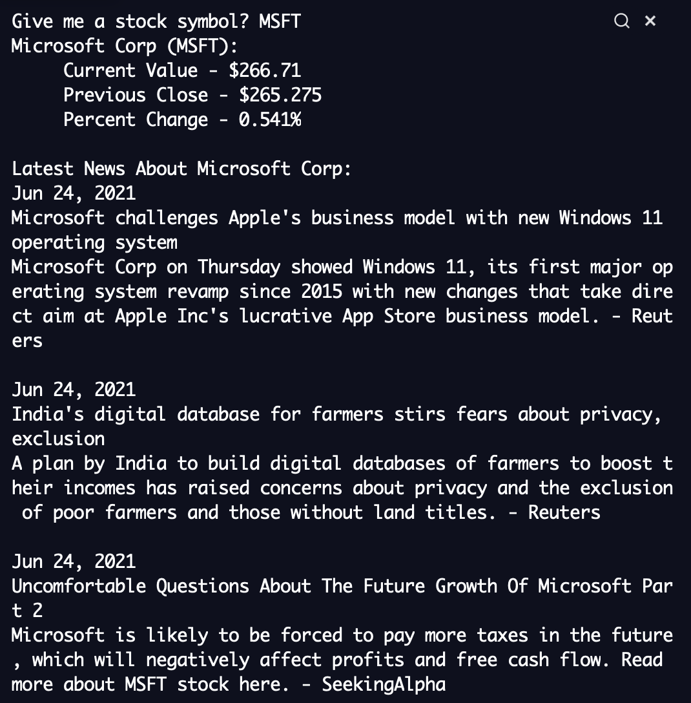

# Stock Visualizer
Python application to access real-time data about a company's stock price and latest economic news by entering stock symbol

## Features
* Utilizes Finnhub API to access stocks, company and news
* Implements `requests` and `json` libraries to make HTTP web requests
* Uses `datetime` library to access current date for latest news and format UNIX timestamp from API

## Preview
